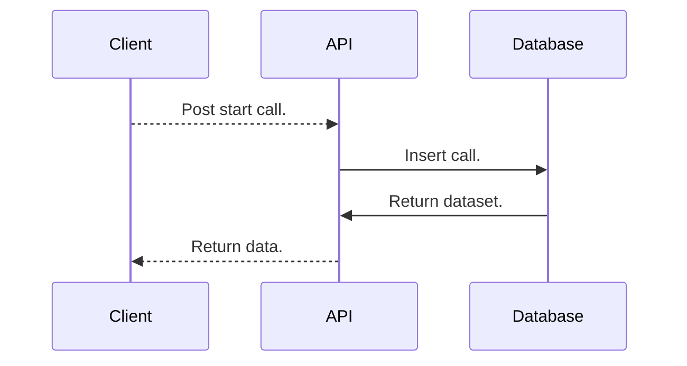
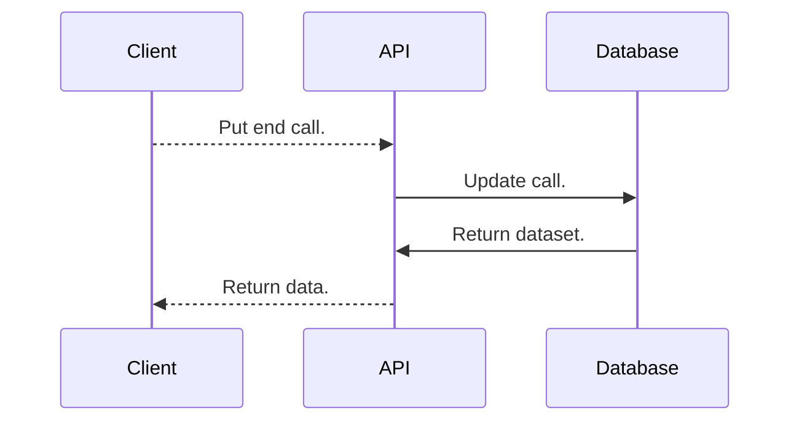
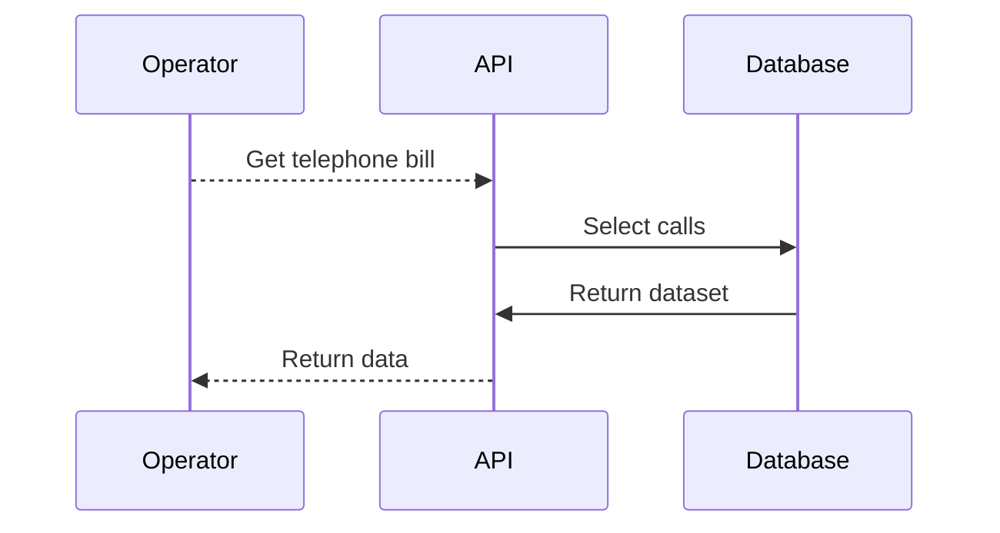

# Diagram
This modeling diagram works together the definitions by "Modeling Database III" from modelig.db.md file.
This model was chosen because solve the challenge, is more clean, fast and easy to maintain.
This model was completly documented on [Postman](https://documenter.getpostman.com/view/680001/RWMFqn4L).

## Start call:
Define the start of call:



**Post:**
```json
{
	"timestamp": "2018-01-01T10:00:00+00:00", // (Optional) Insert the current timestamp.
	"source": "41991954421",
	"destination": "41996754421"
}
```

**Return:**
```json
{
	"id": 1,
	"start": "2018-01-01T10:00:00+00:00",
	"source": "41991954421",
	"destination": "41996754421",
	"standingCharge": 0.36,
	"chargeMinute": 0.09
}
```

## End call:
Define the end of call:



**Put:**
```json
{
	"id": 1,
	"timestamp": "2018-01-01T10:30:15+00:00", // (Optional) Insert the current timestamp.
}
```

**Return:**
```json
{
	"id": 1,
	"start": "2018-01-01T10:00:00+00:00",
	"end": "2018-01-01T10:30:15+00:00",
	"duration": "00:30:00",
	"source": "41991954421",
	"destination": "41996754421",
	"standingCharge": 0.36,
	"chargeMinute": 0.09,
	"price": 3.06
}
```

## Telephone bill:
List the telephone bill by period:



**Get:**
```json
{
	"source": "41991954421",
	"year": 2018, (Optional) Get the last closed year.
	"month": 1 (Optional) Get the last closed month.
}
```
**Return:**
```json
{
  "source": "41991954421",
  "periodStart": "2018-01-01",
  "periodEnd": "2018-01-31",
  "calls": [
    {
      "destination": "41996754421",
      "start": "2018-01-01",
      "duration": "00:30:00",
      "price": 3.06
    },
    {
      "destination": "41996754421",
      "start": "2018-01-02",
      "duration": "00:05:12",
      "price": 0.81
    }
  ]
}
```
