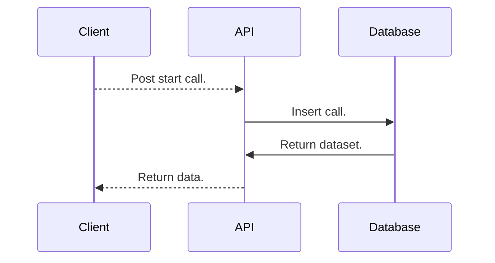
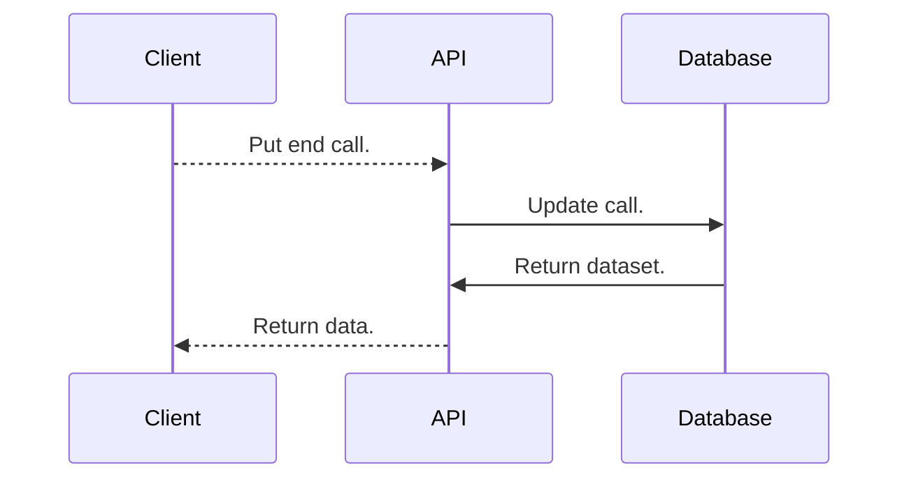
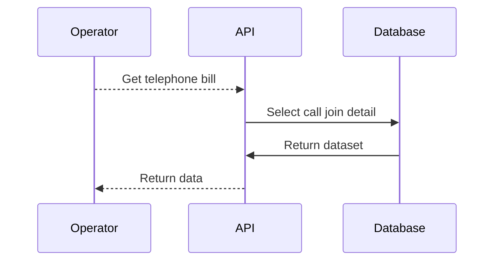

# Diagram
This modeling diagram works together the definitions by "Modeling Database III" from modelig.db.md file.

## Start call:
Define the start of call:



**Post:**
```json
{
	"timestamp": "2018-01-01T10:00:00+00:00", // (Optional) Insert the current timestamp.
	"source": "41991954421",
	"destination": "41996754421"
}
```

**Return:**
```json
{
	"call_id": 1,
	"start": "2018-01-01T10:00:00+00:00",
	"source": "41991954421",
	"destination": "41996754421",
	"standing_charge": 0.36,
	"charge_minute": 0.09
}
```

## End call:
Define the end of call:



**Put:**
```json
{
	"call_id": 1,
	"timestamp": "2018-01-01T10:30:15+00:00", // (Optional) Insert the current timestamp.
}
```

**Return:**
```json
{
	"call_id": 1,
	"start": "2018-01-01T10:00:00+00:00",
	"end": "2018-01-01T10:30:15+00:00",
	"duration_minute": 30,
	"source": "41991954421",
	"destination": "41996754421",
	"standing_charge": 0.36,
	"charge_minute": 0.09
	"price": 3.06
}
```

## Telephone bill:
List the telephone bill by period:



**Get:**
```json
{
	"source": "41991954421",
	"period": "01/2018" // (Optional) Get the last closed month.
}
```
**Return:**
```json
{
  "source": "41 99195-4421",
  "period": "01/2018",
  "calls": [
    {
      "destination": "41 99675-4421",
      "start_date": "01/01/2018",
      "start_time": "10:00:00",
      "duration_minute": "0h30m0s",
      "price": "R$ 3.06"
    },
    {
      "destination": "41 99675-4421",
      "start_date": "02/01/2018",
      "start_time": "16:00:00",
      "duration_minute": "0h5m12s",
      "price": "R$ 0.81"
    }
  ]
}
```